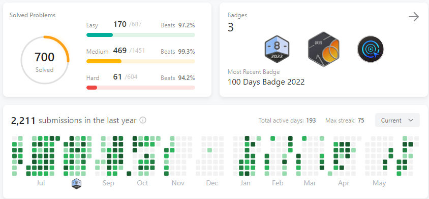

# Introduce

My journey in algorithmic problem-solving has been an integral part of both my academic pursuits and professional career. It began during my initial years of studying computer science when I delved into the fundamentals of numerous algorithms, including but not limited to sorting, searching, dynamic programming, and graph theory.

The theoretical knowledge gained from these studies served as the cornerstone for my continuous practice and refinement in executing these algorithms across multiple coding languages. I've employed platforms like LeetCode, HackerRank, and CodeSignal as my proving grounds, using them to tackle and solve intricate problems that called for optimized algorithmic solutions.

Competitive programming contests have been a vital part of my journey, providing an environment to push my skills to the limit and perfect my problem-solving tactics under the pressure of time constraints.

In the professional realm, these algorithmic skills have been applied to engineer efficient software solutions, amplify system performance, and tackle challenging technical issues. I am adept at devising tailored algorithms to meet specific requirements, and enhancing existing algorithms for improved efficiency and efficacy.

This repository serves as a testament to my ever-growing proficiency in algorithms and my commitment to continual learning in this field.

